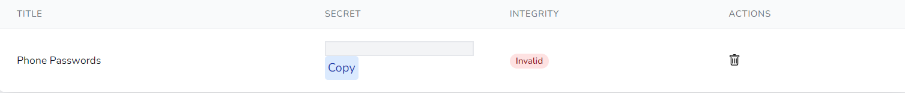
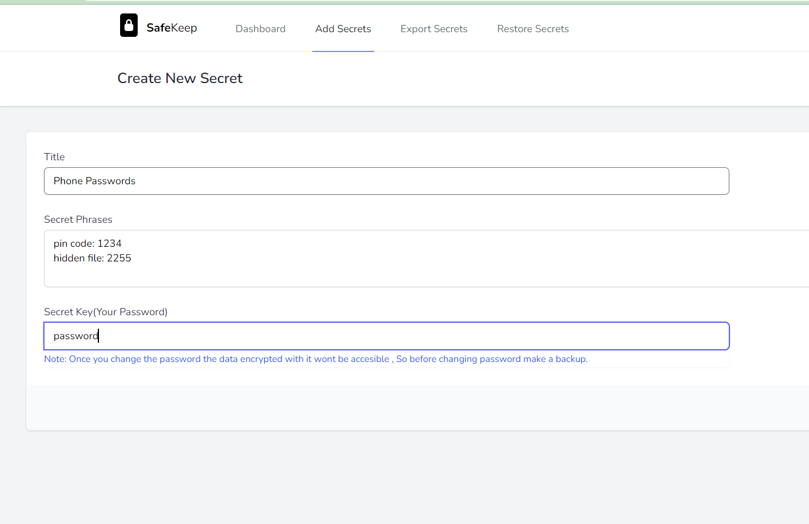
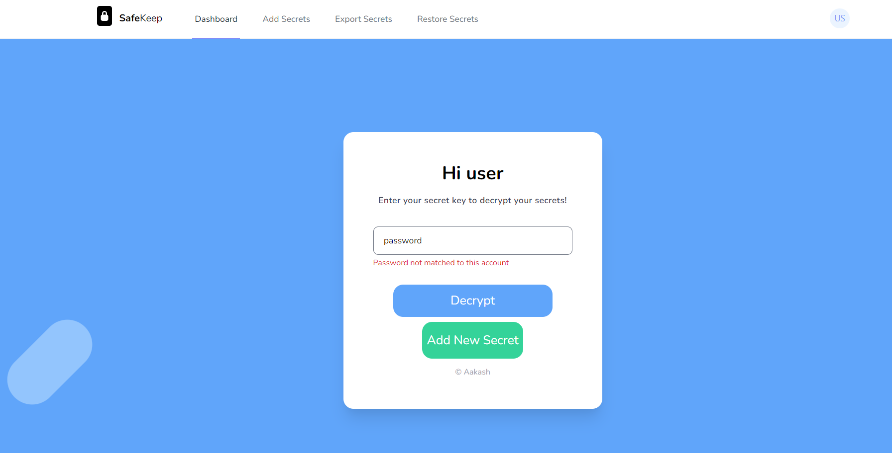
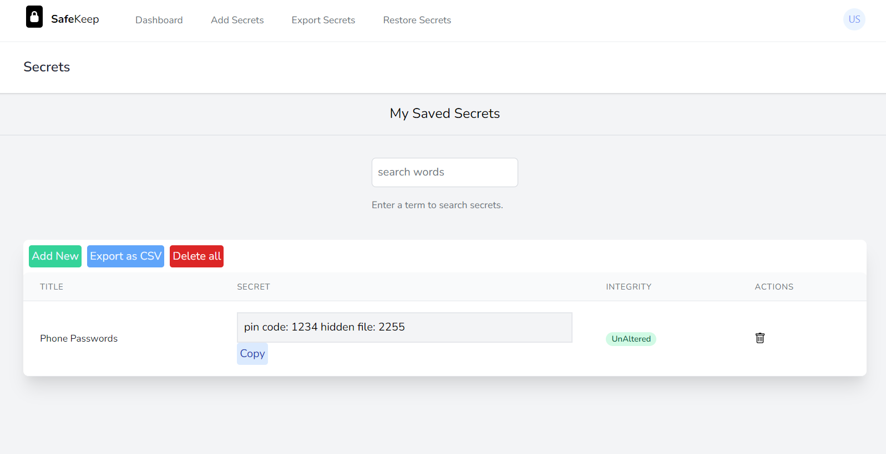
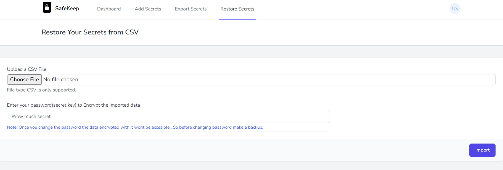

<b>Safe</b>Keep
---

## About SafeKeep

Safe keep allows you to store your personal secrets in a encrypted environment. Nothing much, every thing is decrypted when needed using the password, not the HASH.
- Allows users to see if integrity has been violated
- Easy to add and delete the secrets
- Requires password when you want to see your for decryption
- Search your secrets like theres no tommorow.
- If someone changes the account password by some means then all of the secrets will be invalid
   
## Screenshots
 - Adding Secret
 
 - Decrypt Secrets
  
 - List Secrets
  
 - Restore from CSV file
  

## License

The Laravel framework is open-sourced software licensed under the [MIT license](https://opensource.org/licenses/MIT).
